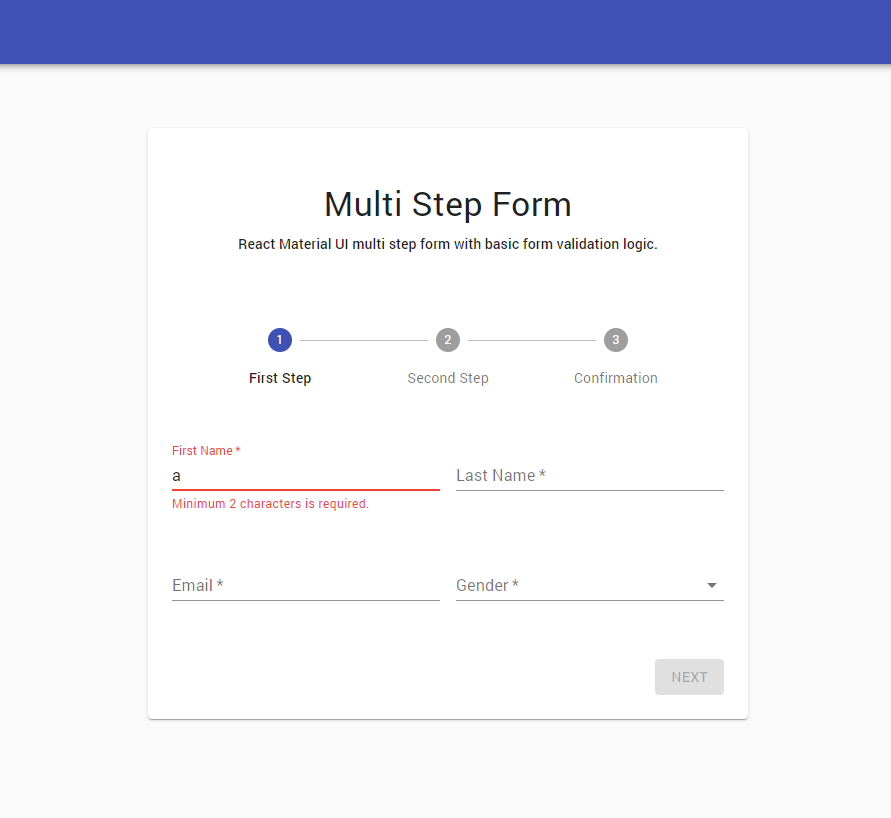

# React Material-ui Step Form

React Material UI multi step form with basic form validation logic. inspired by [Traversy Media](https://www.youtube.com/watch?v=zT62eVxShsY) tutorial and using Material-ui [checkout](https://material-ui.com/getting-started/templates/checkout/) free template.

<hr />



### Instructions

- Download or clone the repo:

```
git clone https://github.com/awran5/react-material-ui-step-form.git
```

### Dependencies

- [Material-UI](https://material-ui.com/) v4.11.0
- React version supports [Hooks](https://reactjs.org/docs/hooks-intro.html)

### Changelog - 10/2020

- Update dependencies
- Imporved validation method
- Fixed some bugs
- cleaning up unnecessary code

### [Demo](https://react-material-ui-step-form.vercel.app/)

### [codeSandbox](https://codesandbox.io/s/react-material-ui-step-form-ui788)
