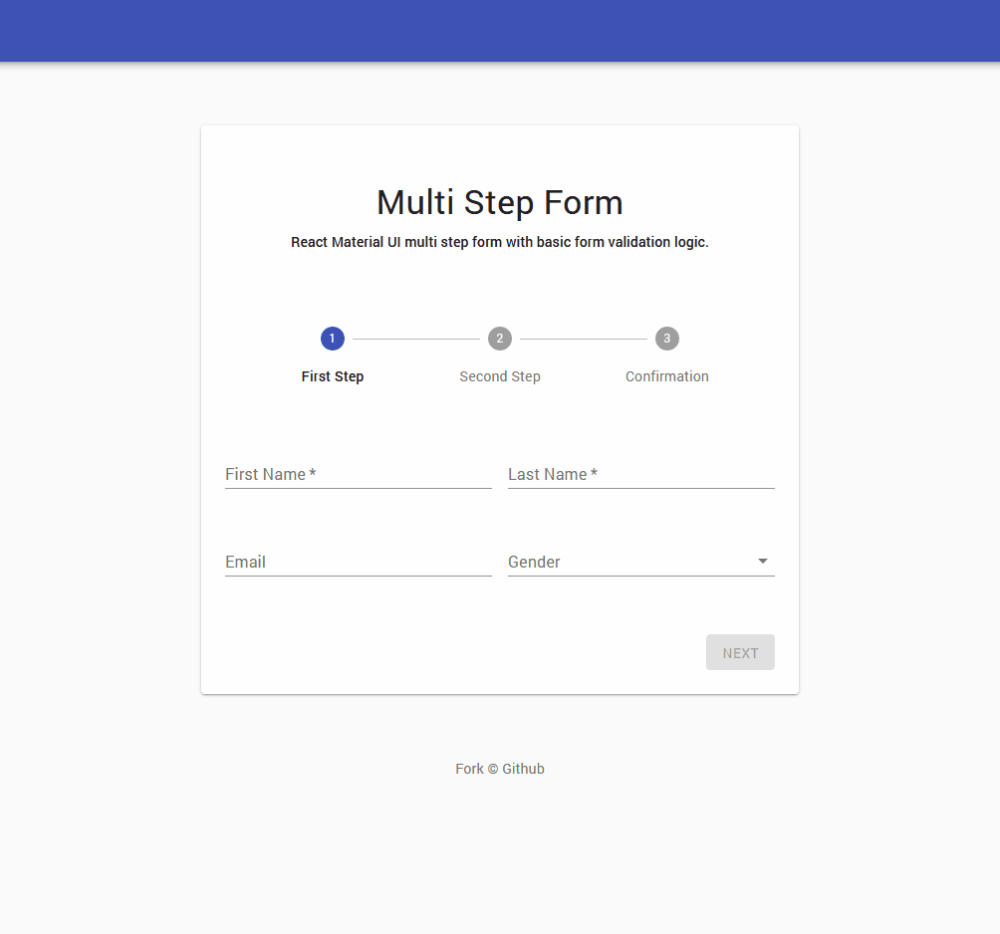

# React Material-UI Step Form

React Material UI multi step form with basic form `onChange` validation logic. inspired by [Traversy Media](https://www.youtube.com/watch?v=zT62eVxShsY) tutorial and using Material-ui [checkout](https://material-ui.com/getting-started/templates/checkout/) free template.

<hr />



### Instructions

- Download or clone the repo:

```sh
git clone https://github.com/awran5/react-material-ui-step-form.git
```

### Dependencies

- [Material-UI](https://material-ui.com/) v5 or higher
- React version supports [Hooks](https://reactjs.org/docs/hooks-intro.html)

```jsx
// src/Context.tsx
const variant = 'standard' // `filled` | `outlined` | `standard`
const margin = 'normal' // `dense` | `none` | `normal`
```

### Example

```tsx
type ValidationSchema = Record<
  string,
  {
    value?: any
    error?: string
    required?: boolean
    validate?: 'text' | 'number' | 'email' | 'phone' | 'zip' | 'checkbox' | 'select'
    minLength?: number
    maxLength?: number
    helperText?: string
  }
>


// src/initialValues.tsx
const initialValues: ValidationSchema = {
  yourFieldname: {
    value: '',                          // will be filled with field value
    error: '',                          // will be filled with error message
    required: true,                     // if `false` field will be still validated but will not enable the `next` button
    validate: 'text',                   // field validation logic (see types above)
    minLength: 2,                       // validate min length
    maxLength: 20,                      // validate max length
    helperText: 'custom error message'  // change the default error message (applied to `validate` types only)
  },
  {
    // another field
  }
}
```

### Changelog - 10/2021

- Update: MUI v5
- fix: minor bugs
- style: cleaning up

### Changelog - 07/2021

- Refactor: code to Typescript
- Refactor: Validation logic, now you can control all validaton logic inside `src/initialValues.tsx` file
- Update: app dependencies
- Add: React Context provides to manage Components state
- Add: Option to change all fields `variant` and `margin` that applied to [TextField](https://material-ui.com/api/text-field/)
- Add: eslint with [airbnb](https://www.npmjs.com/package/eslint-config-airbnb) style
- Add: [Checkbox](https://material-ui.com/components/checkboxes/) field
- Add: `Required` field logic

<br />

### [Live Demo](https://react-material-ui-step-form.vercel.app/)

<br />

[](https://codesandbox.io/s/react-material-ui-step-form-ui788?fontsize=14&hidenavigation=1&theme=dark)
